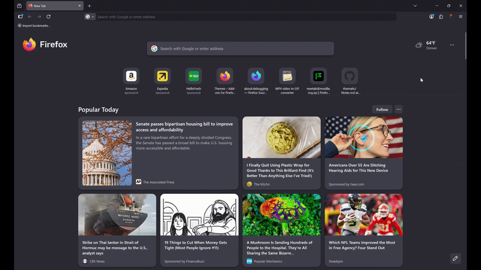

# Vivida

Quickly switch and group your Firefox themes


  [](https://github.com/CS3250Team3SP26/Vivida/actions) [](https://github.com/CS3250Team3SP26/Vivida/actions) [](https://sonarcloud.io/summary/new_code?id=CS3250Team3SP26_Assignment1)
  
---

## Description

Vivida is a Firefox extension that brings order to your theme collection. Switch between your themes instantly from the popup, and use the Groups page to organize them into named collections. No more digging through Firefox's settings every time you want a fresh look.

---

---

## Installation

### For Users
 
> 🔗 Vivida will be available on the Firefox Add-ons store soon. Link will be added here upon release.
 
---
 
### For Developers
 
**Prerequisites**
- [Node.js](https://nodejs.org/) v20 or higher
- [Firefox](https://www.mozilla.org/firefox/) browser
 
**1. Clone the repository**
```bash
git clone https://github.com/CS3250Team3SP26/Vivida.git
cd Vivida
```

**2. Install dependencies**
```bash
npm ci
```

**3. Load the extension in Firefox**
1. Open Firefox and navigate to `about:debugging`
2. Click **This Firefox** in the left sidebar
3. Click **Load Temporary Add-on**
4. Navigate to the `src/` folder and select `manifest.json`
5. Vivida will now appear in your Firefox toolbar
 
> Note: Temporary add-ons are removed when Firefox is closed. Repeat step 3 each time you restart Firefox during development.
---

## Usage
 
### Switching Themes
1. Click the Vivida icon in your Firefox toolbar to open the popup
2. Your groups are listed, starting with the **Default Group** which contains Firefox's built-in themes
3. Click any theme to switch to it instantly
 
### Managing Groups
1. Click **Manage Groups** in the popup to open the options page
2. From here you can:
   - **Create** a new group
   - **Activate** a different group
   - **Delete** a group
   - **Organize themes** between groups by dragging and dropping them
 
---

## Development Setup

**Prerequisites**
- [Node.js](https://nodejs.org/) v20 or higher
- [Firefox](https://www.mozilla.org/firefox/) browser

| Command | Description |
|---|---|
| `npm run lint` | Run ESLint ||
| `npm run test` | Run Jest tests |
| `npm run test:coverage` | Run tests with coverage report |
| `npm run test:watch` | Watch mode for TDD |
| `npm run docs` | Generate JSDoc documentation |

---

## Project Structure

```
Vivida/
├── .github/workflows/       # CI pipeline and badge generation
├── assets/                  # README assets (demo gif)
├── badges/                  # Auto-generated Jest coverage badges
├── src/
│   ├── background/          # Background scripts and event listeners
│   ├── icons/               # Extension icons (16, 32, 48, 128px)
│   ├── lib/                 # Shared business logic modules
│   ├── options/             # Settings/preferences page
│   ├── popup/               # Popup UI
│   └── manifest.json        # Extension manifest
├── test/
│   ├── integration/         # Integration tests
│   └── unit/                # Unit tests for lib/ modules
├── eslint.config.js
├── jsdoc.config.json
└── package.json
```

---

## Contributing / Definition of Done


**Definition of Done** — a feature/fix is complete when:
1. No known defects
2. 90%+ unit test code coverage
3. 100% of API documented with JSDoc
4. User documentation up to date
5. All production code reviewed via pull request
6. `main` branch up to date and tagged by release

Workflow to create a new feature - (feature branches → PR → review → merge to `develop` → `main`).

---

## Tech Stack

A clean, scannable list:

- **Language:** JavaScript ES6+
- **Platform:** Firefox WebExtensions (Manifest V2)
- **Testing:** Jest with jsdom
- **Static Analysis:** ESLint (flat config), SonarCloud
- **Documentation:** JSDoc
- **CI/CD:** GitHub Actions